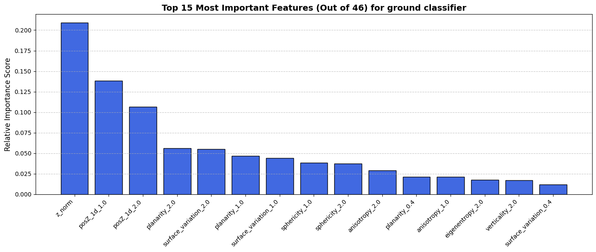
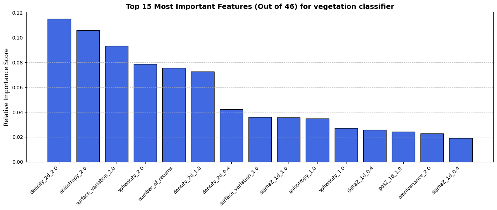
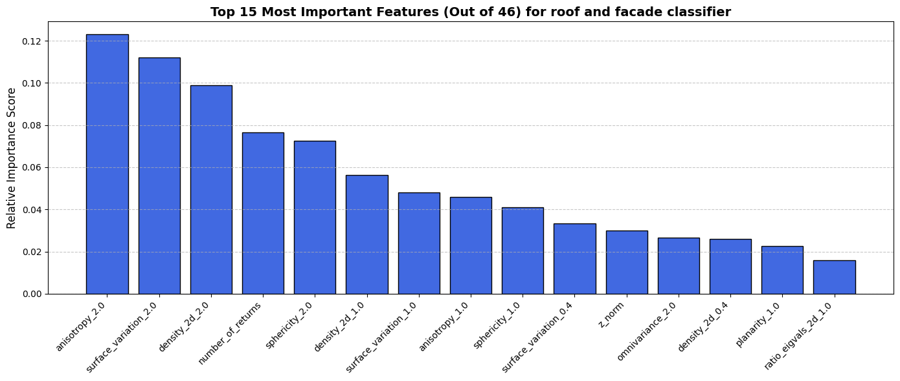
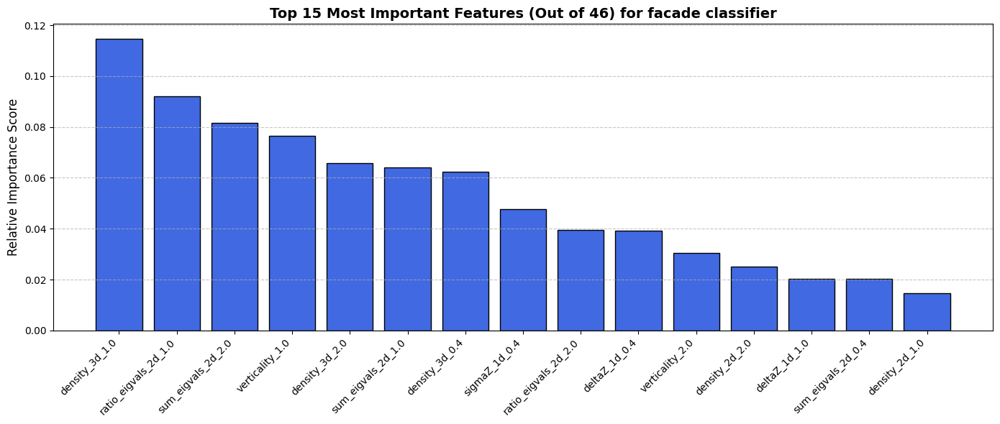

# Documentation
This is the *point-cloud-classifier* documentation. It describes the main idea of every algorithm for the generation of a classified point cloud. 
Currently, 5 classes are implemented:
* [Ground Class](#21-ground-class)
* [(Large) Vegetation Class](#22-large-vegetation-class)
* [Roof Class](#23-roof-class)
* [Facade Class](#24-facade-class)
* [Roof Structures Class](#25-roof-structures-class)
* [Vehicles Class](#26-vehicles-class)

The approach used was mostly based in [geometric features](#1-geometric-features) without deep learning. Therefore, the computation of geometric features is needed and handled in this package:
* [GeometricFeatureCalculation](#12-geometricfeaturecalculatorpoint_cloud_path-str-slope-float--none--none)

The main README can be fnd here: [README](../README.md)

## 1. Geometric Features
All those geometric attributes first compute the covariance matrix of the subset of points selected know as the 3D structure tensor, whith its eigenvalues $\lambda_1 \geq \lambda_2 \geq \lambda_3\geq 0$ and combine those in a list of geometric indicators as shown below. Those indicators were taken from the paper *[Contour Detection in Unstructured 3D Point Clouds](https://openaccess.thecvf.com/content_cvpr_2016/papers/Hackel_Contour_Detection_in_CVPR_2016_paper.pdf)* which has as goal to detect contours with a binary classifier, which is not exactly the goal that we persue. Most of the classifier proposed come originally from the paper *[Feature Relevance Assessment for The Semantic Interpretation Of 3D Point Cloud Data](https://isprs-annals.copernicus.org/articles/II-5-W2/313/2013/isprsannals-II-5-W2-313-2013.pdf)*.

### 1.1 Description

For describing the local dimensionality, the measures of linearity $L_\lambda$, planarity, $P_\lambda$ and scatter (i.e. sphericity) $S_\lambda$ provide information about the presence of a linear 1D structure, a planar 2D structure or a volumetric 3D structure:
* $L_\lambda = \frac{\lambda_1 - \lambda_2}{\lambda_1}$
* $P_\lambda = \frac{\lambda_2 - \lambda_3}{\lambda_1}$
* $S_\lambda = \frac{\lambda_3}{\lambda_1}$

Further measures are provided by omnivariance $O_\lambda$, anisotropy $A_\lambda$, eigenentropy $E_\lambda$ and the sum of eigenvalues denoted as $\Sigma_\lambda$. Exploiting the change of curvature denoted as $C_\lambda$ has also been proposed.
 * $O_\lambda = \sqrt[3]{\lambda_1\lambda_2\lambda_3}$
 * $A_\lambda = \frac{\lambda_1-\lambda_3}{\lambda_1}$
 * $E_\lambda = -\sum\limits_{i=1}^3 \lambda_i \ln(\lambda_i)$
 * $\Sigma_\lambda = \lambda_1 + \lambda_2 + \lambda_3$
 * $C_\lambda = \frac{\lambda_3}{\lambda_1 + \lambda_2 + \lambda_3}$

 Other features that can be noted are Verticality V and density D.
 * $V = 1 - n_z$ , where $n_z$ is the third component of the normal vector $n$
 * $D = \frac{k + 1}{\frac{4}{3}\pi r^3_{k_{NN}}}$ , where $r_{k_{NN}}$ represents the radius of the spherical neighborhood defined
by a 3D point and its k closest neighbors.

Some feature are more oriented in the vertical directino such as poles, we can project the 3d points onto a 2d horizontal plane $\mathcal{P}$. Then we can derive the local 2D density based on a $r_{k_{NN}, 2D}$. We then get the 2d eigenvalues and we can also have their ratio $R_{\lambda, 2D}$ as indicator.
* $D_{2D} = \frac{k + 1}{\pi r^2_{k_{NN}, 2D}}$
* $R_{\lambda, 2D} = \frac{\lambda_{2,2D}}{\lambda_{1,2D}}$
* $\Sigma_{\lambda, 2D} = \lambda_{1,2D} + \lambda_{2,2D}$

One can also introduce binning into a raster called accumulation map $\mathcal{M}(X,Y)$ of the 2D plane, that max show the presence of a 3D structure if its bin value is high. From it, we can derive the height difference $\Delta Z$ and the standard deviation $\sigma_z$. One can also imagine that we want to know the relative position of a given point in the vertical structure $\tilde z$.
* $\Delta Z$
* $\sigma_z$
* $\tilde z$

### 1.2 `GeometricFeatureCalculator(point_cloud_path: str, slope: float | None = None)`

The geometric features are computed thanks to the class `GeometricFeatureCalculator`. The constructor needs as input the path to a point cloud with format `(copc).laz` or `(copc).las`. All the possible features are visible in `REQUIRED_FEATURES` for `constants.py`.

#### 1.2.1 `compute_relative_z(feature_names: list[str] = ["z_norm"]) -> None`
This methods computes the relative Z-coordinate (altitude) with respect to a simulated cloth which should find the ground. This is done using the cloth simulation filter described in the paper *[An Easy-to-Use Airborne LiDAR Data Filtering Method Based on Cloth Simulation](https://www.mdpi.com/2072-4292/8/6/501)*. The parameters are adjusted based on the mean slope of the tile (works only for canton NE tiles with `\d{7}_\d{7}` format) or the input slope given to the constructor.

```python
    csf.params.bSloopSmooth = True
    csf.params.cloth_resolution = max(np.round(-0.0226 * self.slope + 1.045), 0.2)
    csf.params.rigidness = 3 if self.slope < 5 else (2 if self.slope < 20 else 1)
    csf.params.time_step = 0.65
    csf.params.class_threshold = 0.5
    csf.params.interations = 200 
```
The linear regression on the `cloth_resolution` and `rigidness` conditions are based on empirical tests on NE-tiles. 

#### 1.2.2 `compute_3d_features(features: dict[str, list[float]]) -> None`
This method computes different geometric features (`str`) on a sphere with given radii (`list[float]`). In order to do so, the library [jakteristics](https://github.com/jakarto3d/jakteristics) was used.

#### 1.2.3 `compute_2d_features(features: dict[str, list[float]]) -> None`
This method computes different geometric features (`str`) on a cylinder with $Z \in \left] -\infty, +\infty \right[$ with given radii (`list[float]`). In order to do so, the library [jakteristics](https://github.com/jakarto3d/jakteristics) was used.

#### 1.2.4 `compute_3d_features(features: dict[str, list[float]]) -> None`
This method computes different geometric features (`str`) based on the z-axis distribution of a raster of resolution ($r\times r$) with r (`list[float]`).


## 2. Classes
The classes are all determined one after the other with a binary rule:
* 1: points belong to the class
* 0: points stays unclassified

The data for the classifier is transformed from point cloud to `points` (N x 3D xyz np.ndarray), `data` (all computed features, N x 46 np.ndarray per default) and if there is already a classification, `Y` (N, np.ndarray with labels or 1/0 labelisation). This is done with the static method `DataClassifierFormat.load_data()`. The entire pointcloud can be easily classified as follow:
````python
all_labels = classifier.predict(X, points)
visualize_point_cloud_classification(points, all_labels, "./visualization/All_classified_campagne.laz")
````

### 2.1 Ground Class
The ground class is separated using a binary random forest classifier on 46 features (geometric features, return number, number of return and intensity). This choice was made to improve the flaws of the cloth simulation filter, but it uses the attribute `z_norm` computed with the cloth simulation filter. The importance of each feature in the pretrained RF classifier can be seen in the plot below:


In order to classify data into ground points, we can use the following method:
```python
classifier = PointCloudClassifier()
points, X = DataClassifierFormat.load_data(point_cloud_path, fraction_of_dataset=1)
ground_labels = classifier.classify_ground_points(X)
```

### 2.2 (Large) Vegetation Class
The vegetation detection algorithm is a bit more complex. At first, it also uses a binary random forest classifier, but it asks for a confidence greather than `certainity_threshold` which is 0.86 per default. The goal of this entire filter is to maximize the precision and not the recall.


Then the point cloud is voxelized and each voxel is considered as vegetation based on a majority voting of points with RF-classification of probability > `certainity_threshold`. After this, a contamination algorithm is applied, called `scipy.ndimage.binary_dilation` (binary since vegetation = True, empty or not vegetation = False), which turn each neighbour of a vegetation voxel to a candidate. This has been decided because tree tips are oftem very hard to find out with a random forest classifier because of the nature of the geometric features. The contamination process is applied `max_dilation` times. In addition to the dilated grid, it checks cluster size of non vegetation clusters (containing non vegetation points) which should be smaller or equal to `max_tip_size`. If the voxel is then classified as a candidate voel from the dilation and its "isolated" and small enough, it will be considered vegetation. Then entire cluster has then to be bigger or equal to `veg_cluster_sizes` since we want to keep large vegetation and not small isolated points. Finally, blurring filter is applied to avoid outlier points.

This classifier works best if the ground is already removed. Otherwise, tree trunks for example will not be found.

````python
mask1 = ~ground_labels.astype(bool)
vegetation_labels = classifier.classify_vegetation_points(points[mask1], X[mask1])
````
### 2.3 Roof Class
As for the vegetation classifier, the roof classifier is using a binary random forest classifier based on the geometric features to detect roof AND facade classes (increases the result accuracy), but the underlying algorithm to label roof is more complex.


The first step is the computation of the normals of each point. A loop is then applied to detect planes using RANSAC and DBSCAN algorithm. The candidate points for a RANSAC plane each given iteration are filtered by the direction where most points have their normals and that are predicted as true by the random forest classifier, to increase the change of two points really being in the same plane. Once the plane is fitted, the plane inliers are take from the entire pointcloud (based on the distance to the plane and a threshold `inlier_distance_threshold`) and then a DBSCAN that is applied to cluster them. Only the points in the biggest cluster are then labeled as roof and are then removed in the next iteration. The cluster must however a least contain a fraction of `fraction_correctly_classified` point that are classified as roof/facade by the random forest classifier. To avoid ground artefacts, a roof is considered a roof if its `z_norm` computed feature is > than `min_z`, usually 2 meters.

````python
mask2 = ~vegetation_labels.astype(bool)
roof_labels = classifier.classify_roof_points(points[mask1][mask2], X[mask1][mask2])
````

### 2.4 Facade Class
The facade classifier uses most of the time the exact same idea as the roof classifier, with a different random forest classifier and some added elements to the algorithm described above.


To work, a threshold on the candidate was set based on a normal that should not be more than `normal_z_threshold` away from the horizontal. Additionally, a dbscan was applied before fitting the plane, since the low density of points and the probability of having points in the same direction made it so planes would most often fit in the in the xy directions.

A further addition was the fact that the points that come out of the classifier must be in a raster pixel where a roof, previously classified, is also present, and is located below a elevation model of roof points.

````python
mask3 = ~roof_labels.astype(bool)
facade_labels = classifier.classify_facade_points(points[mask1][mask2][mask3], X[mask1][mask2][mask3], points[mask1][mask2][~mask3])
````

### 2.5 Roof Structures Class
The roof classifier ist the first one not using a random forest classifer. It only uses two criteria: every point above the roof elevation model and on a 2d roof mask is classified as roof structure. This supposes that the vegetation and previous classes have been removed. We must also notice that furth improvement could see the following idea: Only take points that are within voxels contiguous to the roof voxels. To avoid holes in the roof mask, the `scipy.ndimage.binary_closing` was used. The roof elevation model looks like follow:

````python
mask4 = ~facade_labels.astype(bool)
roof_structure_labels = classifier.classify_roof_structure_points(points[mask1][mask2][mask3][mask4], points[mask1][mask2][~mask3])
````

### 2.6 Vehicles Class
The vehicle classifier uses deep learning with a U-Net, called CarNet, in order to recognize vehicles. The architecture is in the class `CarNet` and consists of 3 encoder steps with convolution and max pooling layers and 3 decoder steps with transposed convolutions alons with data leaks between equal level of encoder to decoder. It works on 64 x 64 pixel images with 4 input channels as shown below:

The resolution of the pixels can be defined while training. Multiple models have been tested and the per default one uses 0.25 m rasterized points. Those  points are all the remaining points not yet classified. If previous classifier are changed. the model will require new training.

````python
mask5 = ~roof_structure_labels.astype(bool)
vehicles_labels = classifier.classify_car_points(points[mask1][mask2][mask3][mask4][mask5], X[mask1][mask2][mask3][mask4][mask5])
````